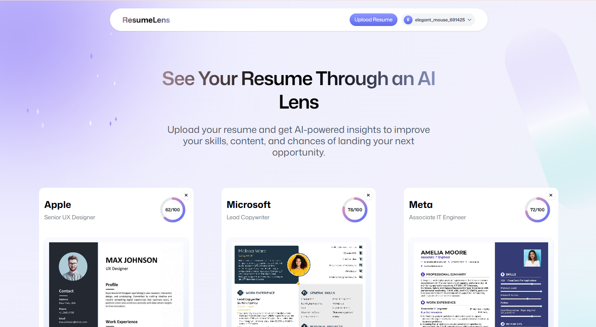

# ResumeLens

<p align="center">
  
  
  
  
</p>

<p align="center">
  
  
  
  
</p>

<p align="center">
  <strong>AI-powered resume analysis for smarter job applications.</strong>
</p>

<p align="center">
  Upload your resume, provide your target job details, and get AI-generated feedback including ATS scoring, resume insights, and actionable improvement suggestions.
</p>

<p align="center">
  <a href="https://resumelens-tau.vercel.app">
    <strong>🚀 Live Demo</strong>
  </a>
</p>

<p align="center">
  
</p>

---

## Overview

**ResumeLens** is a web application that analyzes resumes against a target job opportunity and provides structured AI-powered feedback.

The application combines resume processing, AI analysis, ATS scoring, and detailed feedback into a single workflow.

```text
Upload Resume
      ↓
Enter Job Details
      ↓
Process PDF
      ↓
AI Resume Analysis
      ↓
ATS Score + Feedback
      ↓
Detailed Resume Review
```

---

## Features

- 📄 **Resume Upload** — Upload PDF resumes through a drag-and-drop interface.
- 🎯 **Job Matching** — Analyze a resume against a company, role, and job description.
- 🤖 **AI Analysis** — Generate structured feedback using Claude through Puter.js.
- 📊 **ATS Scoring** — Get an overall score and ATS-focused improvement tips.
- 🔍 **Detailed Review** — View summary, scoring, feedback, and resume preview.
- 🗂️ **Resume History** — Access previously analyzed resumes.
- 🗑️ **Data Management** — Delete individual resumes or wipe application data.
- 🔄 **Error Recovery** — Retry recoverable upload, processing, and AI failures.
- 📱 **Responsive UI** — Supports desktop, tablet, and mobile layouts.

---

## Tech Stack

| Technology | Purpose |
|---|---|
| React | User interface |
| TypeScript | Type-safe development |
| React Router | Routing and navigation |
| Vite | Development and build tooling |
| Tailwind CSS | Styling |
| Zustand | Application state |
| React Dropzone | File upload |
| PDF.js | PDF processing and preview generation |
| Puter.js | Authentication, storage, KV, and AI |
| Claude Sonnet 4.6 | Resume analysis |

---

## Architecture

```text
resumelens/
├── app/
│   ├── components/
│   ├── lib/
│   ├── routes/
│   ├── app.css
│   ├── root.tsx
│   └── routes.ts
├── constants/
├── public/
│   ├── icons/
│   ├── images/
│   └── screenshots/
├── types/
├── package.json
├── react-router.config.ts
├── tsconfig.json
└── vite.config.ts
```

Puter-related operations are centralized in:

```text
app/lib/puter.ts
```

---

## How It Works

### 1. Authentication

Users authenticate through Puter. Protected application routes check authentication before displaying application data.

### 2. Resume Upload

The user provides:

- Resume PDF
- Company name
- Job title
- Job description

The resume is uploaded through the application's file-handling layer.

### 3. PDF Processing

The uploaded PDF is converted into an image representation for preview.

```text
PDF
 ↓
PDF.js
 ↓
Resume Preview Image
```

Both the original PDF and preview image are stored.

### 4. AI Analysis

ResumeLens sends the uploaded resume and job-specific instructions to the AI service.

```text
Resume PDF
     +
Job Title
     +
Job Description
     ↓
Claude Sonnet 4.6
     ↓
Structured Feedback
```

### 5. Data Storage

Resume information and generated feedback are stored using Puter's key-value storage.

Resume records use the following key pattern:

```text
resume:<uuid>
```

### 6. Resume Review

The generated review page displays:

```text
Overall Score
      ↓
Summary
      ↓
ATS Analysis
      ↓
Detailed Feedback
      ↓
Resume Preview
```

---

## Data Flow

```text
                    ┌─────────────────┐
                    │      User       │
                    └────────┬────────┘
                             │
                             ▼
                    ┌─────────────────┐
                    │ Resume Upload   │
                    └────────┬────────┘
                             │
                             ▼
                    ┌─────────────────┐
                    │     PDF.js      │
                    │   PDF → Image   │
                    └────────┬────────┘
                             │
                             ▼
                    ┌─────────────────┐
                    │    Puter FS     │
                    │ PDF + Preview   │
                    └────────┬────────┘
                             │
                             ▼
                    ┌─────────────────┐
                    │   Claude AI     │
                    │ Resume Analysis │
                    └────────┬────────┘
                             │
                             ▼
                    ┌─────────────────┐
                    │    Puter KV     │
                    │ Resume + Data   │
                    └────────┬────────┘
                             │
                             ▼
                    ┌─────────────────┐
                    │   Review Page   │
                    │ Score + Feedback│
                    └─────────────────┘
```

---

## Getting Started

### Prerequisites

- Node.js 20+
- npm
- Git

Check your versions:

```bash
node --version
npm --version
git --version
```

### Installation

Clone the repository:

```bash
git clone https://github.com/MrBengaliHacker/resumelens.git
cd resumelens
npm install
```

### Development

Start the development server:

```bash
npm run dev
```

The application will normally be available at:

```text
http://localhost:5173
```

### Type Checking

```bash
npm run typecheck
```

### Production Build

```bash
npm run build
```

---


## Development Philosophy

ResumeLens is being developed with a focus on:

- Clean and maintainable code
- Reusable React components
- Type-safe development
- Recoverable user flows
- Practical application architecture
- Small and logical Git commits
- Progressive UI improvement
- Production-oriented development practices

The project began with a tutorial-based foundation and is being progressively developed into an independent application with its own design, behavior, and architecture.

---

## Contributing

Suggestions, improvements, and contributions are welcome.

Clone the repository:

```bash
git clone https://github.com/MrBengaliHacker/resumelens.git
cd resumelens
npm install
```

Create a feature branch:

```bash
git checkout -b feature/your-feature
```

Make your changes, test them, and create a clear commit.

When opening a pull request, describe:

- What changed
- Why the change was made
- How it was tested

---

## License

This project is licensed under the **MIT License**.

See the [LICENSE](LICENSE) file for details.

---

## Author

**Ritam Mondal**

- GitHub: [MrBengaliHacker](https://github.com/MrBengaliHacker)

---
⭐ If you found this project useful, consider giving the repository a star.